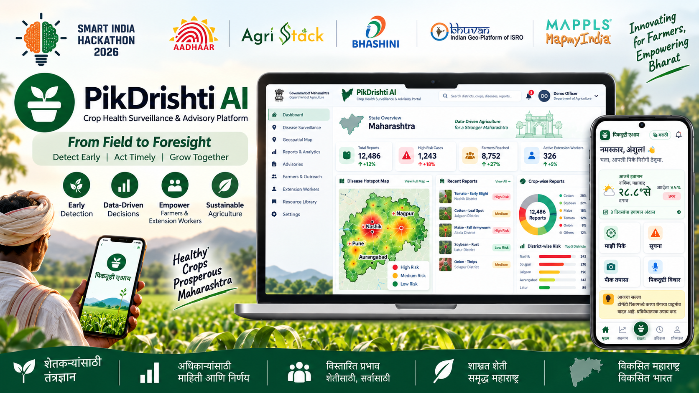
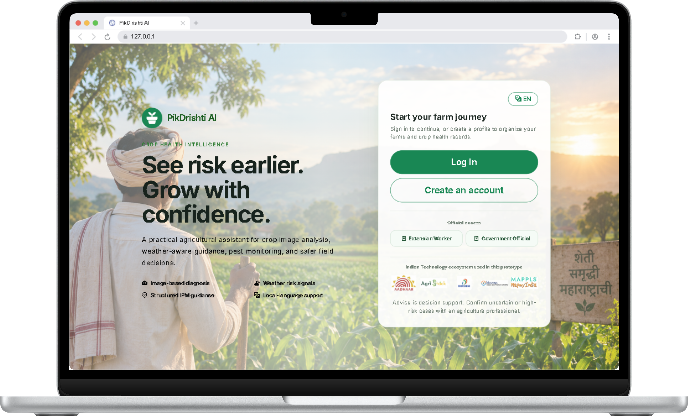
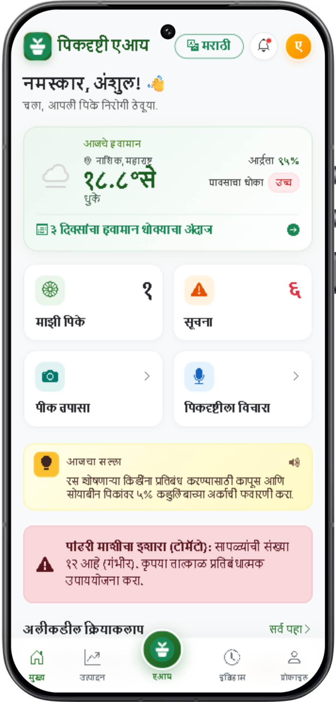
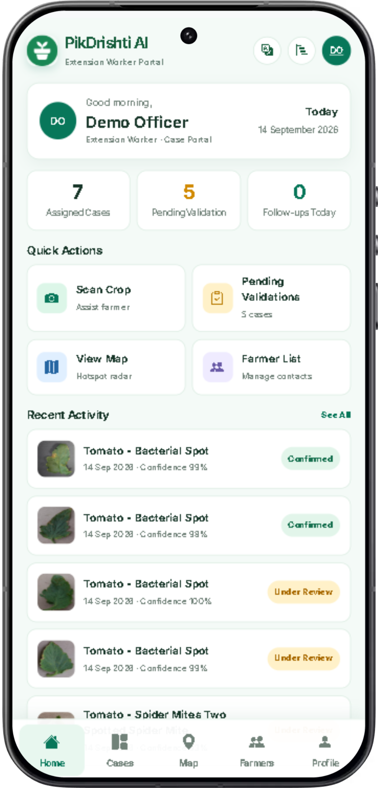
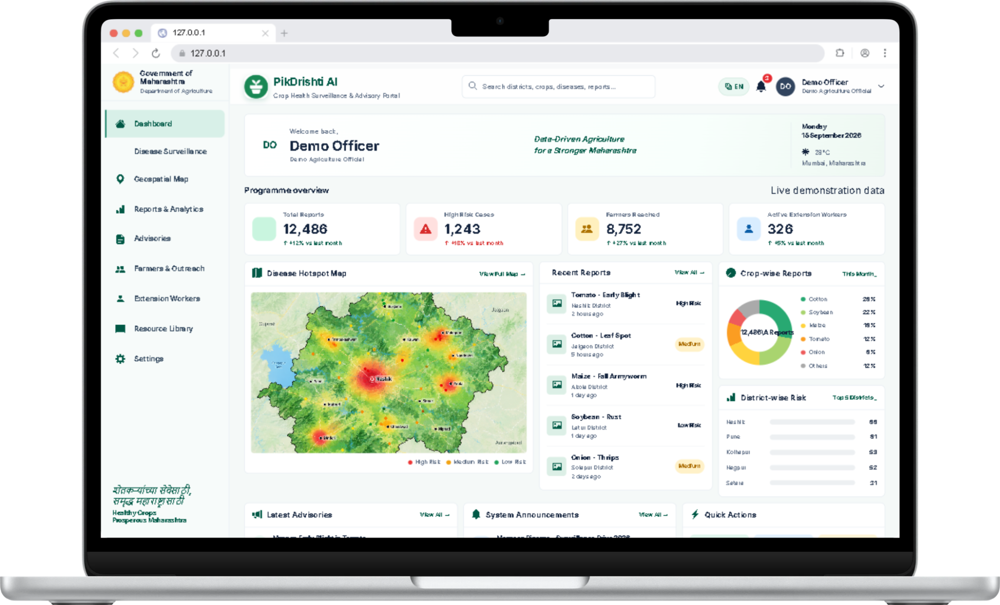

<h1>
  
  PikDrishti AI
</h1>



PikDrishti AI is a mobile-first crop-health and agricultural advisory platform for farmers, extension workers, and agriculture officials. It combines image-based disease identification, weather risk signals, farm records, pest-trap inputs, expert validation, laboratory referral, follow-up monitoring, geospatial hotspot views, and multilingual advisories in one workflow.

| Login Portal |
| ------------- |
|  |

| Farmer | Extension Worker |
| ------------- | ------------- |
|  |  |

| Governemnet Portal |
| ------------- |
|  |

> **Important disclaimer:** PikDrishti AI is **not official software of the Government of Maharashtra or any other government department**. It is a pre-hackathon working prototype created for **Smart India Hackathon 2026**. Government-style branding, dashboards, maps, reports, metrics, and demonstration data are used only to communicate a possible solution. This project must not be used for legal, regulatory, medical, agricultural, procurement, or official government decision-making purposes at this stage.

## SIH 2026 Problem Statement

- **Problem Statement ID:** 26131
- **Title:** Early detection and management of crop diseases and pest infestations
- **Organization:** Government of Maharashtra
- **Department:** Maharashtra State Innovation Society, Department of Skills, Employment, Entrepreneurship and Innovation
- **Category:** Software
- **Theme:** Agriculture, FoodTech & Rural Development

### Problem

Farmers often recognise diseases or pest infestations only after visible damage has spread. Extension staff cover large areas, and laboratory diagnosis or expert advice may not be immediately available. Weather, crop stage, variety, soil condition, and local pest history influence crop-health risk, but these inputs are rarely combined into timely, actionable farm-level alerts.

Delayed or incorrect diagnosis can result in inappropriate pesticide use, higher cultivation costs, residue concerns, reduced yields, and avoidable crop loss.

### Expected solution and outcome

The proposed system provides farmer- and extension-worker-friendly support for image-based symptom identification, pest-trap or sensor inputs, weather-based forecasting, geospatial hotspot mapping, expert validation, multilingual advisories, integrated pest and disease management, safe-input guidance, laboratory referral, and follow-up monitoring.

Expected impact includes earlier detection, reduced crop loss, more targeted pesticide use, faster extension response, improved surveillance coverage, and better preventive planning by agriculture officials.

## Project Workflow

```text
Farmer registers
    -> Adds farm, crop, variety, soil and location details
    -> Uploads a crop or leaf image with observations
    -> Disease model predicts the likely condition and confidence
    -> Weather and IPM services add local risk and management context
    -> Farmer receives multilingual advisory and safe next steps
    -> Low-confidence or high-risk case is referred to an extension worker
    -> Extension worker validates, advises, refers to a laboratory, or rejects
    -> Follow-up visit and outcome are recorded
    -> Aggregated demonstration data is shown on the official dashboard
```

### Farmer experience

- Create an account and manage farms and crops.
- Submit crop images, observations, and location context.
- Receive disease or pest predictions with confidence and explanations.
- View weather conditions and agricultural risk signals.
- Get structured IPM guidance, safe-input precautions, and monitoring steps.
- Use English, Marathi, or Hindi assistant and voice-oriented support where configured.
- Review analysis history, follow-ups, and yield-related information.

### Extension-worker experience

- Access a protected officer dashboard and case queue.
- Review submitted images, predictions, confidence, observations, and advisory context.
- Mark cases as under review, confirmed, uncertain, rejected, or laboratory referral.
- Add expert notes, confirmed disease, laboratory name, sample ID, and result.
- Create follow-up plans with priority, due date, action, status, and notes.
- Record field visits and monitor unresolved cases.

### Government demonstration experience

- View programme-level indicators and response metrics.
- Review dummy disease reports and district risk distribution.
- View a demonstration disease hotspot map.
- Monitor follow-up activity, advisories, announcements, and outcome trends.
- Use the portal as a concept for future surveillance and intervention planning.

## Technical Architecture

PikDrishti AI is a Flask application using an application-factory structure:

```text
Browser / mobile UI
        |
        v
Flask routes and JSON APIs
        |
        +--> SQLAlchemy models and SQLite database
        +--> DiseaseService -> TensorFlow/Keras model
        +--> IPMService -> structured management guidance
        +--> WeatherService -> weather and risk assessment
        +--> GeminiService + RAG -> assistant and advisory enrichment
        +--> BhashiniService -> translation, speech recognition, text-to-speech
        +--> Mappls integration -> geospatial map support
```

### Main components

- `app/main.py`: farmer, extension-worker, field-visit, and government portal routes.
- `app/api.py`: disease analysis, assistant, weather, translation, speech, and related APIs.
- `app/models.py`: users, farms, crops, disease analyses, reviews, follow-ups, conversations, and supporting records.
- `app/services/disease_service.py`: image preprocessing and Keras inference.
- `app/services/ipm_service.py`: deterministic IPM and safe-input guidance.
- `app/services/gemini_service.py`: Gemini assistant and advisory enrichment with RAG context.
- `app/services/weather_service.py`: weather retrieval, agricultural risk scoring, and Maharashtra hotspot context.
- `app/services/bhasini_service.py`: multilingual and voice service integration.
- `app/templates/`: Jinja farmer, authentication, extension-worker, and government screens.
- `app/static/`: CSS, JavaScript-compatible static assets, uploads, icons, and demonstration map assets.
- `models/disease_model.keras`: configured crop disease model.

## Technology and Integrations

- **Backend:** Python 3, Flask, Flask-SQLAlchemy, Flask-Login, Flask-Bcrypt, Flask-Caching, Jinja2.
- **Database:** SQLite by default, with `DATABASE_URL` support for another SQLAlchemy-compatible database.
- **Machine learning:** TensorFlow/Keras image classification, NumPy, and supporting Python ML utilities.
- **Generative AI:** Google Gemini for conversational agricultural assistance and advisory enrichment.
- **Knowledge support:** Local knowledge-base retrieval through the RAG service.
- **Weather:** Configurable weather API for current conditions, forecasts, and crop-risk assessment.
- **Language and voice:** Bhashini APIs for translation, ASR, and TTS where credentials are configured.
- **Maps:** Mappls API/SDK support for geospatial views; the government dashboard also includes safe demonstration fallback data.
- **Frontend:** Server-rendered Jinja templates, Bootstrap utilities/icons, responsive CSS, and mobile-first layouts.
- **Deployment:** `Dockerfile`, `runtime.txt`, and `run.py` are included for local or container-based execution.

## Repository Layout

```text
config.py                 Application configuration and environment settings
run.py                    Development entry point
requirements.txt          Python dependencies
app/
  __init__.py              Flask factory and database compatibility setup
  api.py                   JSON endpoints
  auth.py                  Authentication routes
  main.py                  Main application and officer routes
  models.py                SQLAlchemy data models
  services/                AI, weather, IPM, language, news, and RAG services
  templates/               Farmer, worker, auth, and government UI
  static/                  CSS, icons, uploads, and map assets
ml/disease/                Training, evaluation, and dataset utilities
models/                    Trained model and disease metadata
knowledge_base/            Local agricultural reference content
```

## Setup and Running Locally

### Requirements

- Python 3.10 or newer recommended.
- A virtual environment.
- TensorFlow-compatible hardware or CPU installation.
- Optional API credentials for live external services.

### Windows PowerShell

```powershell
python -m venv venv
.\venv\Scripts\Activate.ps1
pip install -r requirements.txt
Copy-Item .env.example .env  # if an example file is available
python run.py
```

### macOS or Linux

```bash
python3 -m venv venv
source venv/bin/activate
pip install -r requirements.txt
python run.py
```

Open the local URL printed by Flask, normally `http://127.0.0.1:5000`.

### Environment configuration

Create a local `.env` file and configure only the services you need:

```env
FLASK_SECRET_KEY=replace-with-a-local-secret
DATABASE_URL=sqlite:///agrivision.db
DEMO_MODE=true
DISEASE_MODEL_PATH=models/disease_model.keras
DISEASE_CONFIDENCE_THRESHOLD=0.70

GEMINI_API_KEY=
GEMINI_MODEL=gemini-2.5-flash
WEATHER_API_KEY=
MAPPLS_MAP_API=

BHASHINI_USER_ID=
BHASHINI_API_KEY=
BHASHINI_PIPELINE_ID=
BHASHINI_INFERENCE_API_KEY=
```

Never commit `.env`, API keys, private datasets, uploaded farmer images, or local database files. The project defaults to demo-friendly behavior when optional API credentials are missing.

## Important Routes

- `/`: public landing page.
- `/login`, `/register`: farmer authentication.
- `/dashboard`: farmer dashboard.
- `/scan`: crop image submission flow.
- `/disease-result/<id>`: analysis result and advisory.
- `/assistant`: agricultural assistant.
- `/admin/login`: extension-worker login.
- `/admin`: extension-worker dashboard.
- `/admin/cases`: case queue.
- `/admin/cases/<id>`: case review and validation.
- `/admin/cases/<id>/follow-up`: follow-up plan.
- `/admin/farmers/<id>/field-visit`: field visit record.
- `/government`: protected government demonstration portal.
- `POST /api/disease/analyze`: image analysis API.

The officer prototype credentials are intentionally simple for local demonstrations. Replace the authentication and role model before any real deployment.

## Safety, Limitations, and Next Steps

- Model predictions are decision-support signals, not laboratory diagnoses.
- Weather, hotspot, government dashboard, and outcome values may be simulated or demonstration data.
- External API availability, quotas, authentication, and service terms apply.
- IPM guidance is not a complete pesticide registry or legal product recommendation.
- Farmers must follow local agricultural officer advice, registered product labels, protective-equipment requirements, pre-harvest intervals, and applicable law.
- Production use requires verified datasets, model evaluation across local crops and conditions, human-in-the-loop approval, secure role-based access, audit logs, privacy controls, consent, monitoring, and official data partnerships.
- Future work includes calibrated model evaluation, live sensor and pest-trap ingestion, verified laboratory workflows, Mappls production configuration, official district feeds, outcome learning, offline-first mobile support, and deployment security hardening.
