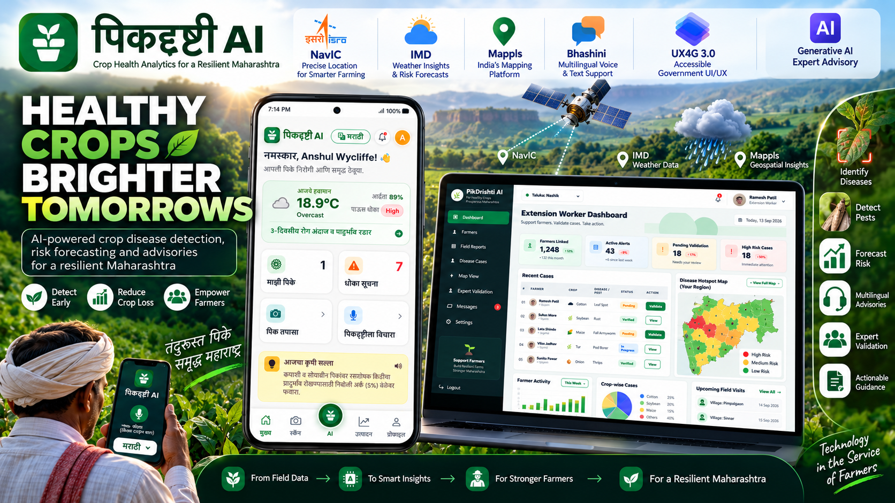
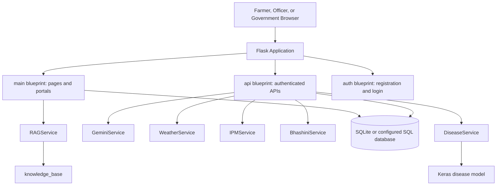

<h1>
  
  PikDrishti AI
</h1>



PikDrishti AI is a mobile-first crop-health and agricultural advisory platform for farmers, extension workers, and government agriculture teams. It combines image-based disease identification, farm records, weather risk signals, pest-trap monitoring, integrated pest and disease management guidance, multilingual assistance, expert validation, laboratory referral, field follow-up, and a government surveillance dashboard.

> **Important disclaimer:** PikDrishti AI is **not official software of the Government of Maharashtra or any other government department**. It is a project idea and working prototype created for the **Smart India Hackathon**. The government-style portal, branding references, dashboards, reports, maps, and metrics are included only to demonstrate a possible solution concept. They do not represent official government systems, endorsements, datasets, reports, or statistics.

| Farmer | Government Portal |
| ------------- | ------------- |
|  | |


The project currently serves two connected experiences:

- **Farmer application:** capture crop evidence, receive disease and risk guidance, manage farms and crops, monitor weather, use the assistant, and review history.
- **Operations and government views:** validate cases, record expert and laboratory outcomes, manage follow-ups, and view a wireframe-inspired crop-health surveillance dashboard.

The application is suitable for local demonstration, prototyping, evaluation, and further field integration. Some government portal values and visual reports are deliberately dummy data and must not be interpreted as official agricultural statistics.

## Contents

- [Problem and intended outcome](#problem-and-intended-outcome)
- [Current capabilities](#current-capabilities)
  - [Farmer capabilities](#farmer-capabilities)
  - [Extension-worker capabilities](#extension-worker-capabilities)
  - [Government demonstration portal](#government-demonstration-portal)
- [User experiences](#user-experiences)
  - [Farmer flow](#farmer-flow)
  - [Extension-worker flow](#extension-worker-flow)
  - [Government dashboard flow](#government-dashboard-flow)
- [Disease analysis pipeline](#disease-analysis-pipeline)
- [IPM and safe-input guidance](#ipm-and-safe-input-guidance)
- [Expert validation and laboratory referral](#expert-validation-and-laboratory-referral)
- [Government portal](#government-portal)
  - [Route and access](#route-and-access)
  - [Prototype and non-affiliation](#prototype-and-non-affiliation)
  - [Wireframe-inspired structure](#wireframe-inspired-structure)
  - [Demonstration data boundary](#demonstration-data-boundary)
- [Architecture](#architecture)
  - [Application factory](#application-factory)
  - [External services](#external-services)
- [Repository layout](#repository-layout)
- [Technology stack](#technology-stack)
- [Requirements](#requirements)
  - [Local requirements](#local-requirements)
  - [Optional credentials](#optional-credentials)
- [Installation](#installation)
  - [Windows PowerShell](#windows-powershell)
  - [macOS or Linux](#macos-or-linux)
- [Configuration](#configuration)
  - [Configuration notes](#configuration-notes)
- [Running the application](#running-the-application)
  - [Main login areas](#main-login-areas)
- [Routes and APIs](#routes-and-apis)
  - [Farmer pages](#farmer-pages)
  - [Extension and government pages](#extension-and-government-pages)
  - [Farmer APIs](#farmer-apis)
- [Data model](#data-model)
  - [CaseReview referral fields](#casereview-referral-fields)
  - [CaseFollowUp fields](#casefollowup-fields)
- [Disease model and dataset](#disease-model-and-dataset)
- [Testing and validation](#testing-and-validation)
  - [Python compilation](#python-compilation)
  - [Application factory check](#application-factory-check)
  - [Template checks](#template-checks)
  - [Government portal smoke check](#government-portal-smoke-check)
  - [Static asset check](#static-asset-check)
  - [Manual checks](#manual-checks)
- [Operational limitations](#operational-limitations)
  - [Data limitations](#data-limitations)
  - [Model limitations](#model-limitations)
  - [Workflow limitations](#workflow-limitations)
- [Safety and privacy](#safety-and-privacy)
- [Future production work](#future-production-work)
- [License](#license)

## Problem and Intended Outcome

Farmers may identify crop disease or pest pressure only after visible damage has spread. Extension workers often cover large areas, while laboratory diagnosis and expert advice may not be immediately available. Weather, crop stage, variety, soil condition, and local pest history can influence risk, but these inputs are rarely combined into an actionable farm-level workflow.

Incorrect diagnosis can lead to delayed treatment, excessive or inappropriate pesticide use, higher cultivation costs, residue concerns, and yield loss.

PikDrishti AI is designed to support an earlier-response workflow:

1. A farmer submits a crop image and field observations.
2. The disease model returns a prediction and confidence signal.
3. Weather and structured IPM guidance add context and recommended next actions.
4. The farmer receives understandable, multilingual advice.
5. Uncertain or high-risk cases can be sent to extension staff or a laboratory.
6. Officials can validate cases, assign follow-up work, and monitor programme indicators.

The target outcome is earlier detection, reduced crop loss, more targeted input use, faster extension response, improved surveillance coverage, and better planning of preventive interventions.

## Current Capabilities

### Farmer capabilities

- Register and manage farms.
- Store farm location, area, soil type, soil pH, and NPK values.
- Register crops and varieties against farms.
- Capture or upload leaf images from a mobile device.
- Submit farmer observations and location with a scan.
- Receive disease prediction, confidence, symptoms, explanation, and recommendations.
- View structured integrated pest and disease management guidance.
- See safe-input and pesticide-use precautions.
- View current weather and a three-day risk forecast.
- Log pest-trap readings and generate simulated trap readings for demonstrations.
- View disease and yield history.
- Use text chat, speech recognition, translation, text-to-speech, and voice chat where configured.
- Use English, Marathi, and Hindi language flows.

### Extension-worker capabilities

- Sign in to the protected officer portal.
- View recent disease cases and workflow counts.
- Open a case with submitted evidence and IPM guidance.
- Record a decision: under review, confirmed, uncertain, laboratory referral, or rejected.
- Store confirmed disease, officer notes, expert advisory, and review timestamp.
- Record laboratory name, sample ID, referral notes, laboratory result, and referral timestamp.
- Create one current follow-up plan for a reviewed case.
- Record follow-up priority, status, due date, next action, and notes.
- View active follow-ups from the admin dashboard.

### Government demonstration portal

The protected `/government` page is a dashboard-style demonstration of a future agriculture command centre. It currently includes:

- Maharashtra Government branding and official-style navigation.
- PikDrishti AI brand bar with language modal support.
- Government programme KPI cards.
- Static hotspot map image at `app/static/images/dummy_map.png`.
- Recent reports list with crop, disease, district, time, and risk.
- Crop-wise report donut visualization.
- District-wise risk bars.
- Latest advisories.
- System announcements.
- Quick-action tiles.
- Responsive desktop and mobile layout.

The government portal uses dummy presentation data supplied by the route in `app/main.py`. It is not connected to official government systems, live district feeds, or verified surveillance statistics.

## User Experiences

### Farmer flow

```text
Landing page
  -> Login or registration
  -> Farmer dashboard
  -> Farm and crop setup
  -> Crop scan
  -> Disease result and IPM guidance
  -> Assistant or follow-up action
  -> History and yield prediction
```

### Extension-worker flow

```text
Admin login
  -> Case dashboard
  -> Open disease case
  -> Review evidence and IPM plan
  -> Confirm, reject, mark uncertain, or refer to laboratory
  -> Add advisory and notes
  -> Create follow-up plan
  -> Monitor due date and status
```

### Government dashboard flow

```text
Admin login
  -> Government portal
  -> Programme KPI overview
  -> Hotspot and report view
  -> District risk and crop distribution
  -> Advisories and announcements
  -> Quick operational actions
```

## Disease Analysis Pipeline

The primary analysis endpoint is `POST /api/disease/analyze`.

1. The user uploads an image from the scan screen.
2. The API validates the file and stores it under the static upload area.
3. `DiseaseService` loads the configured Keras model and performs inference.
4. The service maps the predicted class into a crop and disease name.
5. Low-confidence results are returned as uncertain rather than being presented as a reliable diagnosis.
6. Gemini can enrich the prediction with symptoms, recommendations, prevention, and explanation in the selected language.
7. `IPMService` creates a deterministic structured IPM baseline.
8. The result is saved in `DiseaseAnalysis`, including structured data in `gemini_data`.
9. The frontend redirects to `/disease-result/<analysis_id>`.

The model is intended as decision support. It should not be treated as a laboratory diagnosis or as permission to apply a pesticide without checking local registration and product labels.

## IPM and Safe-Input Guidance

`app/services/ipm_service.py` creates a structured plan with the following categories:

- Cultural controls
- Mechanical controls
- Biological controls
- Chemical controls
- Monitoring plan
- Referral conditions
- Safe-input guidance

The IPM service is deliberately conservative. It can recommend field sanitation, spacing, drainage, scouting, tool hygiene, extension review, and laboratory confirmation before a curative spray. Chemical guidance emphasizes:

- Registered products only.
- Crop and disease label compliance.
- Correct dosage and application instructions.
- Protective equipment.
- Re-entry intervals.
- Pre-harvest intervals.
- Resistance-management practices.
- No unverified product mixtures.

The current implementation does not contain a complete, authoritative pesticide registry or localized product-and-dose database.

## Expert Validation and Laboratory Referral

The extension review workflow is implemented in the protected routes:

- `/admin`
- `/admin/cases/<analysis_id>`
- `/admin/cases/<analysis_id>/follow-up`

A review is stored in `CaseReview` and is linked one-to-one with `DiseaseAnalysis`.

When an officer selects `lab_referral`, the case page reveals fields for:

- Laboratory name
- Sample ID
- Referral notes
- Laboratory result

The first referral records `lab_referred_at`. The workflow currently stores referral information; it does not connect to a laboratory information management system, generate barcodes, send samples, or receive results through an external API.

## Government Portal

### Route and access

The page is available at:

```text
http://127.0.0.1:5000/government
```

It uses the existing development admin session. The development login is available at `/admin/login`.

### Prototype and non-affiliation

This portal is a **Smart India Hackathon project prototype**, not an official government application. It is not developed, operated, maintained, endorsed, or authenticated by the Government of Maharashtra, the Department of Agriculture, or any other public authority.

The use of government-style layout patterns, a Maharashtra Government emblem image, department wording, district names, and official-looking dashboard elements is for demonstration and presentation of the proposed solution only. The portal must not be used as a source of official advisories, outbreak reports, public alerts, administrative decisions, or government statistics.

### Wireframe-inspired structure

The page is organized as:

1. Government of Maharashtra sidebar.
2. Dashboard, surveillance, map, reports, advisories, outreach, workers, library, and settings navigation.
3. PikDrishti AI top bar with:
   - Existing local PikDrishti icon.
   - Government portal subtitle.
   - Search-style visual control.
   - Shared language modal.
   - Notification indicator.
   - Dummy `Demo Officer` identity.
4. Welcome panel.
5. Four programme KPIs:
   - Total reports.
   - High-risk cases.
   - Farmers reached.
   - Active extension workers.
6. Three-column intelligence region:
   - Static hotspot map.
   - Recent reports.
   - Crop-wise reports and district-wise risk.
7. Lower operational region:
   - Latest advisories.
   - System announcements.
   - Quick actions.

### Demonstration data boundary

The values shown on the government page are dummy values defined in `government_dashboard()` in `app/main.py`. The map is a static image, not a live map service. The page must be connected to verified district reports, geotagged cases, sensor feeds, and outcome data before it is used for operational decisions or public reporting.

## Architecture

The application uses a Flask application factory and registers three main blueprint areas:



### Application factory

`app/__init__.py`:

- Creates the Flask application.
- Loads `Config`.
- Initializes SQLAlchemy, Flask-Login, Bcrypt, and Flask-Caching.
- Registers the auth, main, and API blueprints.
- Creates missing tables with `db.create_all()`.
- Runs a compatibility helper for older local SQLite schemas.
- Builds the local RAG index during application startup.

This project currently uses lightweight startup schema compatibility logic rather than Alembic migrations. Production deployments should introduce versioned migrations before schema changes become frequent.

### External services

External services are optional in demo mode:

- Gemini: structured explanations and localized AI advice.
- WeatherAPI: live weather and forecast information.
- Bhashini: ASR, translation, and TTS flows.
- Google Translate widget: shared UI translation for Marathi and Hindi.

When credentials are missing or requests fail, several services provide safe fallback or demo responses. This is useful for local demonstrations but should be clearly identified in production monitoring.

## Repository Layout

```text
PikDrishti AI/
├── app/
│   ├── __init__.py                 Application factory and extensions
│   ├── api.py                      Authenticated farmer APIs
│   ├── auth.py                     Registration and login routes
│   ├── main.py                     Page, admin, and government routes
│   ├── models.py                   SQLAlchemy models
│   ├── services/
│   │   ├── bhasini_service.py      ASR, translation, and TTS
│   │   ├── disease_service.py      Keras inference and file validation
│   │   ├── gemini_service.py       Structured AI response generation
│   │   ├── ipm_service.py          Deterministic IPM recommendations
│   │   ├── news_service.py         Agricultural news retrieval
│   │   ├── rag_service.py          Local knowledge retrieval
│   │   ├── weather_service.py      Weather risk and hotspot data
│   │   └── yield_service.py        Yield prediction logic
│   ├── static/
│   │   ├── css/style.css           Shared application styling
│   │   ├── images/                 Icons and government dummy map
│   │   └── uploads/                Follow-up and scan uploads
│   └── templates/
│       ├── admin/                  Extension-worker portal templates
│       ├── auth/                   Authentication templates
│       ├── government/             Government dashboard templates
│       └── ...                     Farmer-facing templates
├── knowledge_base/                 RAG source material
├── ml/disease/                     Training and evaluation scripts
├── models/                         Checked-in model artifacts
├── config.py                       Environment-backed configuration
├── requirements.txt                Python dependencies
├── run.py                          Development entry point
├── runtime.txt                     Runtime version hint
├── Dockerfile                      Container build configuration
└── technical_architecture.md       Extended technical notes
```

## Technology Stack

- Python 3.10 or newer.
- Flask application factory.
- Flask-SQLAlchemy and SQLite by default.
- Flask-Login for farmer authentication.
- Session-based development admin authentication.
- Flask-Bcrypt for password hashing.
- Jinja2 templates.
- Bootstrap 5 and Bootstrap Icons through the base template.
- TensorFlow/Keras and EfficientNet-B0 for disease inference.
- Google Gemini for structured AI enrichment.
- WeatherAPI for live weather and forecasts.
- Bhashini for speech and language services.
- Chart.js for existing farmer history visualizations.
- Requests and feedparser-based news integration.
- Progressive web app manifest and service worker assets.

## Requirements

### Local requirements

- Python 3.10 or newer is recommended.
- A virtual environment.
- Enough memory for TensorFlow and the Keras model.
- A browser with camera and microphone support for the full mobile workflow.
- Network access for optional external services and CDN assets.

### Optional credentials

- Google Gemini API key.
- WeatherAPI key.
- Bhashini user ID and API credentials.
- A strong production Flask secret key.

The project can start in demo mode without the optional credentials, but external service credentials are required for production-quality AI, live weather, and speech integrations.

## Installation

### Windows PowerShell

```powershell
python -m venv venv
.\venv\Scripts\Activate.ps1
pip install -r requirements.txt
python run.py
```

If PowerShell blocks script activation for the current session:

```powershell
Set-ExecutionPolicy -Scope Process -ExecutionPolicy RemoteSigned
.\venv\Scripts\Activate.ps1
```

### macOS or Linux

```bash
python3 -m venv venv
source venv/bin/activate
pip install -r requirements.txt
python run.py
```

Then open:

```text
http://127.0.0.1:5000/
```

The application factory automatically creates database tables and builds the local RAG index during startup.

## Configuration

Create a `.env` file in the project root for non-default configuration:

```env
FLASK_SECRET_KEY=replace_with_a_long_random_secret
DATABASE_URL=sqlite:///agrivision.db

GEMINI_API_KEY=your_gemini_api_key
GEMINI_MODEL=gemini-2.5-flash
WEATHER_API_KEY=your_weatherapi_key

BHASHINI_USER_ID=your_bhashini_user_id
BHASHINI_API_KEY=your_bhashini_api_key
BHASHINI_PIPELINE_ID=64392f96daac500b55c543d5
BHASHINI_INFERENCE_API_KEY=your_bhashini_inference_key

DISEASE_MODEL_PATH=models/disease_model.keras
YIELD_MODEL_PATH=path/to/your/yield_model.pkl

DEMO_MODE=true
DISEASE_CONFIDENCE_THRESHOLD=0.70
DISEASE_BATCH_SIZE=32
```

### Configuration notes

- `DATABASE_URL` defaults to a SQLite database named `agrivision.db` in the project root.
- `DEMO_MODE` defaults to `true` when not explicitly set to `false`.
- `DISEASE_CONFIDENCE_THRESHOLD` controls when inference is treated as uncertain.
- API credentials must never be committed to the repository.
- Replace the development secret before any deployment.

## Running the Application

Start the development server:

```powershell
python run.py
```

The default server listens on `0.0.0.0:5000`, so the local browser URL is:

```text
http://127.0.0.1:5000/
```

### Main login areas

- Farmer registration and login: `/auth/register` and `/auth/login`.
- Extension/admin login: `/admin/login`.
- Government portal: `/government` after admin login.

The development admin credentials are defined in `app/main.py`. They are intentionally simple for local demonstration and must be replaced with proper identity management before production use.

## Routes and APIs

### Farmer pages

| Route | Purpose |
| --- | --- |
| `/` | Landing page or redirect to the farmer dashboard |
| `/dashboard` | Weather, farm summary, alerts, news, and activity |
| `/farms` | Farm records, crop records, profile, and support |
| `/profile` | Alias for the farms/profile page |
| `/crops` | Crop records and pest-trap management |
| `/scan` | Crop image capture and disease analysis input |
| `/disease-result/<analysis_id>` | Diagnosis, IPM, safe-input, and advisory result |
| `/yield` | Yield prediction workflow |
| `/history` | Disease and yield history |
| `/assistant` | Agricultural chat assistant and analysis context |

### Extension and government pages

| Route | Access | Purpose |
| --- | --- | --- |
| `/admin/login` | Public | Development admin login |
| `/admin` | Admin session | Extension case dashboard |
| `/admin/cases/<analysis_id>` | Admin session | Case review, advisory, and laboratory referral |
| `/admin/cases/<analysis_id>/follow-up` | Admin session | Create or update a case follow-up plan |
| `/admin/profile` | Admin session | Demo officer profile |
| `/admin/logout` | Admin session | End admin session |
| `/government` | Admin session | Government surveillance dashboard with dummy data |

### Farmer APIs

| Method | Endpoint | Purpose |
| --- | --- | --- |
| `GET, POST` | `/api/farms` | List or create farms |
| `PUT` | `/api/farms/<farm_id>` | Update a farm |
| `POST, PUT` | `/api/user/profile` | Update farmer profile |
| `GET` | `/api/location/autocomplete` | Search locations and coordinates |
| `POST` | `/api/disease/analyze` | Analyze an uploaded crop image |
| `POST` | `/api/yield/predict` | Create a yield prediction |
| `POST` | `/api/assistant/chat` | Send a message to the assistant |
| `POST` | `/api/bhasini/asr` | Speech recognition |
| `POST` | `/api/bhasini/tts` | Text-to-speech |
| `POST` | `/api/bhasini/translate` | Translation |
| `POST` | `/api/bhasini/voice-chat` | Voice chat workflow |
| `GET` | `/api/weather/risk-forecast` | Three-day weather risk forecast |
| `GET` | `/api/geospatial/hotspots` | Hotspot data service response |
| `GET, POST` | `/api/crops` | List or create crops |
| `POST` | `/api/trap/log` | Log a pest-trap reading |
| `POST` | `/api/trap/simulate/<crop_id>` | Generate a simulated trap reading |

Most farmer data APIs require a Flask-Login authenticated user. Admin and government pages use the current development admin session decorator.

## Data Model

The principal SQLAlchemy models are:

- `User`: farmer identity and credentials.
- `Farm`: farm name, location, area, soil, and nutrients.
- `Crop`: crop variety and farm association.
- `DiseaseAnalysis`: image path, detected crop, disease, confidence, severity, observation, and structured AI data.
- `YieldPrediction`: predicted yield and related disease analysis.
- `Conversation` and `ChatMessage`: assistant history.
- `Recommendation`: stored recommendation records.
- `PestTrap`: manual or simulated trap observations.
- `CaseReview`: extension decision, official notes, expert advisory, and lab referral fields.
- `CaseFollowUp`: current operational follow-up plan connected to a review and analysis.

### CaseReview referral fields

`CaseReview` supports:

- `decision`
- `status`
- `confirmed_disease`
- `notes`
- `expert_advisory`
- `lab_name`
- `lab_sample_id`
- `lab_notes`
- `lab_result`
- `lab_referred_at`
- `reviewed_by`
- `reviewed_at`

### CaseFollowUp fields

`CaseFollowUp` supports:

- `analysis_id`
- `review_id`
- `assigned_to`
- `priority`
- `status`
- `action`
- `due_date`
- `next_action`
- `notes`
- `created_at`
- `updated_at`

The application has a startup compatibility helper for older local SQLite databases. It adds missing workflow columns where possible. Production environments should use versioned migrations instead.

## Disease Model and Dataset

The checked-in model artifacts are:

```text
models/
├── disease_model.keras
├── disease_classes.json
└── disease_metadata.json
```

The inference service uses EfficientNet-B0 and maps class names into crop and disease values. The documented model coverage is focused on PlantVillage-style leaf classes across crops such as tomato, potato, and pepper, with healthy classes included.

Training and evaluation tools are under `ml/disease/`:

- `train.py`: train or fine-tune the classifier.
- `evaluate.py`: create classification reports and confusion matrices.
- `split_dataset.py`: create train, validation, and test splits.
- `predict.py`: run prediction utilities.
- `utils.py`: shared dataset and metadata helpers.
- `DATASET.md`: dataset download and folder guidance.

PlantVillage images are captured in controlled conditions. Real-world field images may differ significantly because of lighting, background, camera angle, occlusion, camera quality, mixed symptoms, and disease stage. Benchmark accuracy must not be presented as guaranteed field accuracy.

## Testing and Validation

### Python compilation

```powershell
python -m compileall -q app
```

### Application factory check

```powershell
.\venv\Scripts\python.exe -c "from app import create_app; app=create_app(); print(app.name)"
```

### Template checks

```powershell
.\venv\Scripts\python.exe -c "from app import create_app; app=create_app(); app.jinja_env.get_template('dashboard.html'); app.jinja_env.get_template('government/dashboard.html'); print('templates valid')"
```

### Government portal smoke check

```powershell
@'
from app import create_app

app = create_app()
client = app.test_client()
with client.session_transaction() as session:
    session['is_admin'] = True

response = client.get('/government')
assert response.status_code == 200
assert b'PikDrishti AI' in response.data
assert b'Demo Officer' in response.data
assert b'images/icons/icon-192.png' in response.data
print('government portal valid')
'@ | .\venv\Scripts\python.exe -
```

### Static asset check

```powershell
.\venv\Scripts\python.exe -c "from app import create_app; app=create_app(); c=app.test_client(); r=c.get('/static/images/dummy_map.png'); print(r.status_code, r.content_type)"
```

### Manual checks

For a meaningful local review, verify:

1. Farmer registration and login.
2. Farm creation and location autocomplete.
3. Crop creation and pest-trap logging.
4. Scan upload and disease result rendering.
5. Assistant text and language selection.
6. Admin case review and lab referral fields.
7. Follow-up creation and update.
8. Government dashboard at desktop and mobile widths.
9. Shared language modal from the government top bar.
10. Static map image loading without an external map API.

## Operational Limitations

The current project is an integrated prototype rather than a production surveillance network.

### Data limitations

- Government dashboard KPIs, reports, advisories, announcements, and district values are dummy data.
- The government map is a static image, not a live geospatial layer.
- Hotspot APIs contain seeded Maharashtra clusters and limited database enrichment.
- The current hotspot implementation does not reliably aggregate verified geotagged field reports.
- Crop stage, variety, soil, weather, pest history, and disease observations are not yet combined in one calibrated farm-level risk model.

### Model limitations

- The disease model is trained around controlled PlantVillage-style imagery.
- Real-world field performance may be lower than benchmark performance.
- Severity is not directly modelled by the vision classifier.
- Some responses use demo fallback behavior when external services are unavailable.
- Confirmed cases are stored, but there is no automated feedback-to-training pipeline.

### Workflow limitations

- Laboratory referrals are stored locally and are not connected to laboratory systems.
- Follow-up currently supports one current plan per review rather than a complete visit timeline.
- The government quick actions are navigation-style demonstration controls, not all connected operational commands.
- Development admin authentication is session-based and not suitable for production identity, authorization, or audit requirements.
- Startup `db.create_all()` and compatibility alterations should be replaced by controlled database migrations.

## Safety and Privacy

- Treat disease predictions as advisory, not definitive diagnosis.
- Seek agriculture professional or laboratory confirmation when symptoms are unclear, severe, rapidly spreading, or high-risk.
- Follow registered product labels, crop restrictions, dosage, re-entry period, and pre-harvest interval.
- Never use unverified pesticide mixtures.
- Use required protective equipment and follow local agricultural regulations.
- Protect uploaded images and farmer observations from unauthorized access.
- Keep API credentials out of source control and logs.
- Replace the fallback development secret key before deployment.
- Do not publish dummy government statistics as official measurements.
- Add role-based permissions and audit logging before exposing government or officer workflows to multiple users.

## Future Production Work

The most valuable next steps are:

1. Replace government dummy data with authenticated district and taluka data feeds.
2. Add geotagged reports and verified case aggregation by crop, disease, and time.
3. Connect the hotspot view to a real map layer with accessible fallback behavior.
4. Add crop-stage, variety, soil, rainfall, humidity, pest-history, and local disease signals to a calibrated risk model.
5. Add real officer accounts, roles, district jurisdiction, and audit logs.
6. Expand follow-up into a visit timeline with contact method, photos, sample collection, and treatment confirmation.
7. Integrate laboratories for sample tracking and result updates.
8. Build a confirmation dataset and model feedback pipeline.
9. Evaluate the model on labelled field images from target regions.
10. Add programme metrics for response time, surveillance coverage, crop loss, pesticide reduction, and intervention success.
11. Replace startup schema patching with Alembic or an equivalent migration system.
12. Add automated tests for routes, authorization, service fallbacks, uploads, and critical workflows.

## License

This repository does not currently declare a software license. Add an appropriate license before distributing the project publicly or accepting external contributions. Also verify the licensing terms of model weights, datasets, icons, fonts, external APIs, and any third-party visual assets before redistribution.

For project changes, preserve existing route contracts where possible, keep farmer and official workflows clearly separated, avoid presenting demonstration values as real surveillance, and validate affected routes and templates before deployment.
