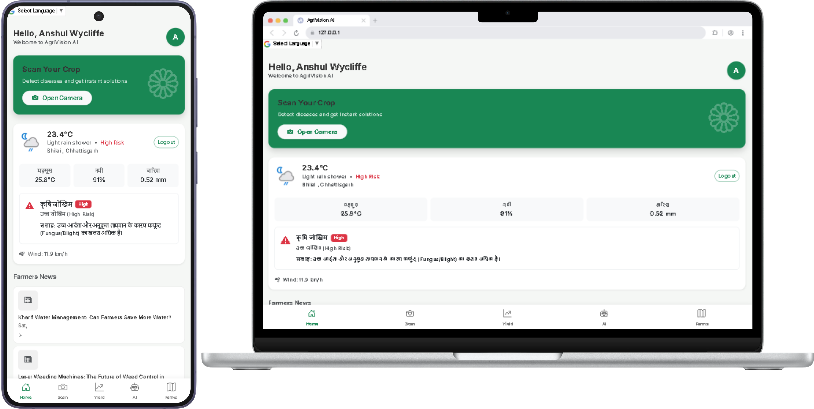
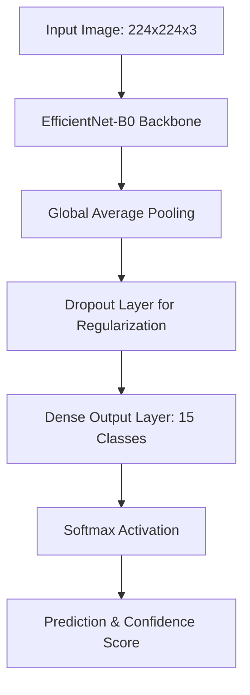
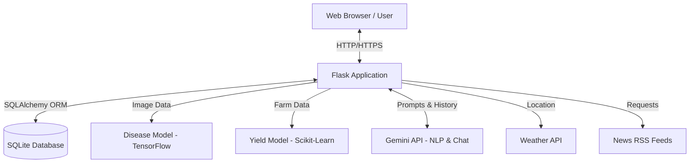
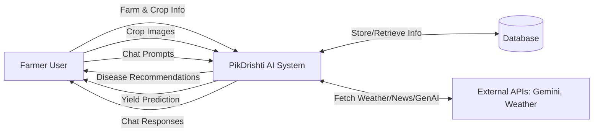
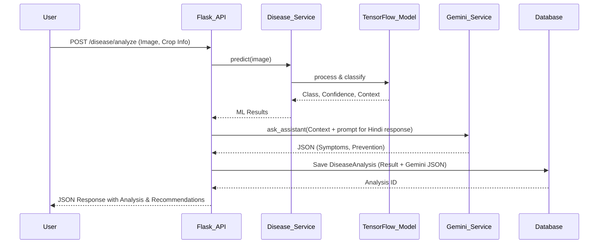
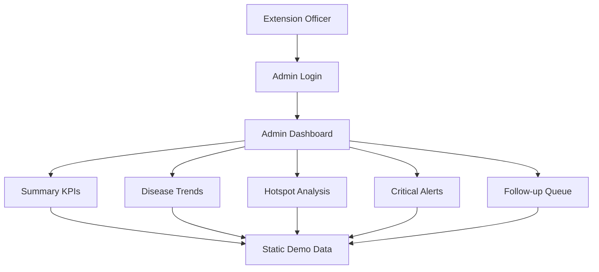
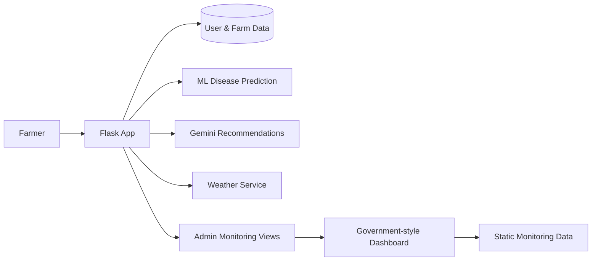
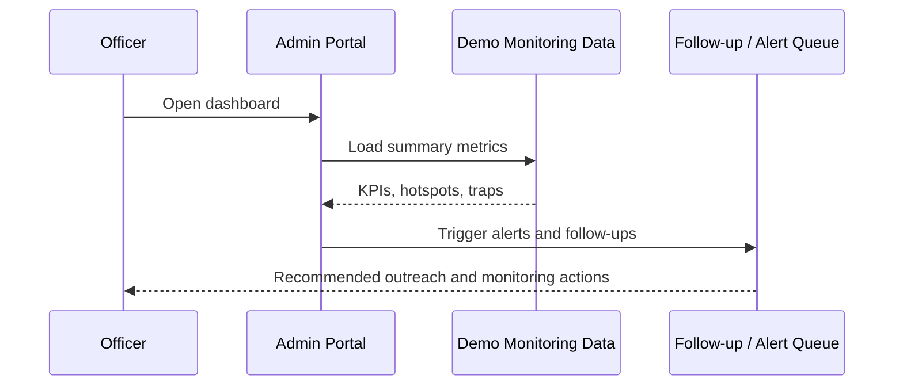

<h1>
  
  PikDrishti AI
</h1>


PikDrishti AI is a comprehensive web-based platform built with Flask, designed to empower farmers with advanced AI and Machine Learning technologies. It assists in managing farms, monitoring crop health, predicting yields, and obtaining real-time insights through an integrated AI assistant.

> 

## Features

- **Farm & Crop Management**: Register and manage multiple farms, including soil nutrients (Nitrogen, Phosphorus, Potassium), and track crops grown on each farm.
- **Disease Analysis (CNN & PlantVillage)**: Automated disease detection powered by an **EfficientNet-B0** TensorFlow model. Trained on the **PlantVillage dataset**, it supports **3 crops** (Tomato, Potato, Bell Pepper) and **15 classes** (12 diseases + healthy states).
- **Yield Prediction**: Predict crop yields per acre based on farm area, crop type, and disease severity using scikit-learn machine learning models.
- **Generative AI (Google Gemini)**: Gemini serves a dual purpose:
  1. **Disease Enrichment**: Translates CNN predictions into structured, localized (Hindi) JSON containing symptoms, chemical/organic recommendations, and prevention strategies.
  2. **Interactive Assistant Chat**: A conversational AI assistant that helps farmers with follow-up queries related to agriculture, maintaining conversation history.
- **Real-Time Weather Integration**: Get localized weather updates for your registered farm locations.
- **Agriculture News**: Stay updated with the latest agricultural news in India.

## Tech Stack

- **Backend Framework**: Python, Flask, Flask-SQLAlchemy, Flask-Login, Flask-Bcrypt, Werkzeug
- **Machine Learning**: TensorFlow (Keras), scikit-learn, NumPy
- **Generative AI**: Google Generative AI (Gemini API)
- **External APIs & Tools**: Requests, Feedparser (for news aggregation)
- **Database**: SQLite (via SQLAlchemy ORM)
- **Server**: Gunicorn

## Core Database Models
- **User**: Handles authentication and links to the user's farms, crops, and histories.
- **Farm**: Stores details like location, area, and soil nutrients (N, P, K).
- **Crop**: Tracks crop types, sowing dates, and expected harvests for each farm.
- **DiseaseAnalysis**: Logs image scan results, ML confidence scores, disease severity, and the parsed JSON recommendations generated by Gemini in Hindi.
- **YieldPrediction**: Stores history of yield predictions.
- **Conversation & ChatMessage**: Stores the conversation history for the AI assistant.

## Project Structure in Detail

```text
PikDrishti AI/
│
├── app/
│   ├── static/               # CSS, JS, Images
│   ├── templates/            # HTML Jinja2 templates
│   ├── services/             # Core Business Logic
│   │   ├── disease_service.py
│   │   ├── gemini_service.py
│   │   ├── weather_service.py
│   │   ├── yield_service.py
│   │   └── news_service.py
│   ├── __init__.py           # Flask app factory
│   ├── api.py                # REST API routes
│   ├── main.py               # View routes
│   ├── models.py             # SQLAlchemy models
│   └── auth.py               # Authentication routes
│
├── models/
│   ├── disease_model.keras   # Saved TensorFlow model
│   ├── disease_classes.json  # Class mappings
│   └── disease_metadata.json # Crop/Disease contextual info
│
├── ml/                       # Training scripts / notebooks
├── requirements.txt          # Python dependencies
├── run.py                    # Entry point
└── .env                      # Environment variables (API keys)
```

## Machine Learning & Disease Detection

PikDrishti AI uses a deep learning computer vision model to detect crop diseases from leaf images.

### Supported Crops and Diseases (15 Classes)
The model is trained on the **PlantVillage dataset** and can classify images into the following categories:
- **Pepper (Bell)**: Bacterial spot, Healthy
- **Potato**: Early blight, Late blight, Healthy
- **Tomato**: Bacterial spot, Early blight, Late blight, Leaf Mold, Septoria leaf spot, Spider mites (Two-spotted spider mite), Target Spot, Tomato Yellow Leaf Curl Virus, Tomato mosaic virus, Healthy

### CNN Architecture (EfficientNet-B0)
We utilize **EfficientNet-B0** as the backbone for image classification.
- **Why EfficientNet?** It uses compound scaling to balance network depth, width, and resolution, providing high accuracy with a very small memory footprint (~20-30MB). This makes it ideal for CPU-bound production environments.



### Model Training Workflow
- **Data Augmentation**: Techniques like random rotation, flipping, and zoom improve model generalization.
- **Transfer Learning**: The EfficientNet-B0 base model is loaded with ImageNet weights. The top layer is removed and replaced with a custom 15-unit Dense layer with softmax activation.
- **Fine-tuning**:
  1. Train only the top layers with a higher learning rate.
  2. Unfreeze top blocks of EfficientNet-B0 and fine-tune with a very low learning rate to adapt features specifically to crop leaves.
- **Preprocessing**: Images are preprocessed to 224x224 pixels and class weights are applied to handle dataset imbalances.

## System Architecture & Data Flow

### 1. System Architecture



### 2. Data Flow Diagram (DFD - Level 1)



### 3. Low-Level Design (LLD) - Disease Analysis Flow



## Prerequisites

- Python 3.8+
- API Keys for Google Gemini API (for AI assistant and detailed disease explanations)
- API Keys for Weather service (if applicable)

## Installation and Setup

1. **Clone the repository**:
   ```bash
   git clone https://github.com/AnshulWycliffe/AgriVision-AI
   cd "PikDrishti AI"
   ```

2. **Create a virtual environment** (recommended):
   ```bash
   python -m venv venv
   # On Windows:
   venv\Scripts\activate
   # On macOS/Linux:
   source venv/bin/activate
   ```

3. **Install the dependencies**:
   ```bash
   pip install -r requirements.txt
   ```

4. **Environment Variables**:
   Create a `.env` file in the root directory of the project and add the necessary environment variables. Example:
   ```env
   FLASK_APP=run.py
   FLASK_ENV=development
   FLASK_DEBUG=1
   FLASK_SECRET_KEY=your_super_secret_key_here
   DATABASE_URL=sqlite:///agrivision.db

   GEMINI_API_KEY=<your_gemini_api_key>
   GEMINI_MODEL=gemini-3.6-flash

   WEATHER_API_KEY=<your_weather_api_key>

   DISEASE_MODEL_PATH=models/disease_model.keras
   YIELD_MODEL_PATH=models/yield_model.pkl

   DEMO_MODE=false
   ```

5. **Run the Application**:
   Start the Flask development server by running:
   ```bash
   python run.py
   ```

6. **Access the App**:
   Open your browser and navigate to `http://127.0.0.1:5000/`.

## Project Update

This project includes a dedicated administrative dashboard and government-style portal experience for extension officers and monitoring teams.

- The admin routes are implemented in `app/main.py` and are protected under the admin login flow.
- The admin dashboards use static demo values for presentation and monitoring use cases, rather than direct database-driven metrics.
- The current UI direction focuses on a light, formal government dashboard aesthetic with clear KPI cards, trend panels, hotspot sections, and follow-up alerts.
- The implementation is designed to support officer workflows such as disease monitoring, surveillance summaries, and critical pest alert tracking.

These admin pages are intended for demonstration, monitoring, and presentation scenarios while the core farmer-facing crop health system remains the main application flow.

The current admin portal is structured around several reporting views:

- a district-wide summary dashboard with KPI cards and overall health indicators
- a surveillance section for field coverage, trap counts, and regional hotspot visibility
- a follow-up and alert view for outreach actions, disease escalation, and inactive farmer monitoring
- a formal light-theme dashboard style intended to resemble a public-sector agricultural monitoring interface

The dashboard data is intentionally maintained as static mock content so the interface remains stable for presentation, stakeholder review, and UI validation without depending on live database records. This keeps the admin experience consistent while the core application continues to manage real user and farm data in the main farmer flows.

In addition, the application architecture is organized around a Flask app factory, SQLAlchemy data models, service-based logic layers, and template-driven UI screens. This separation allows the project to support both production-style farmer functionality and a presentation-ready admin workspace that can later be connected to real analytics feeds when required.

### Admin dashboard architecture



### Farmer to admin data flow



### Monitoring workflow


