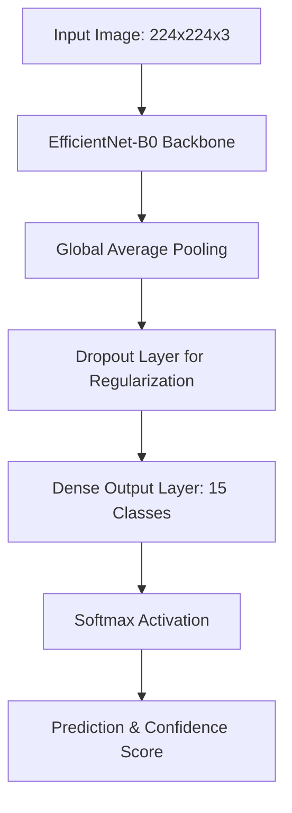
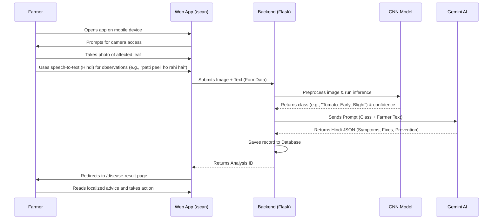
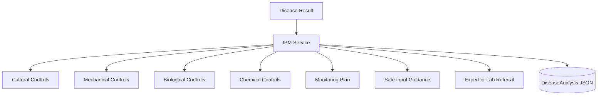
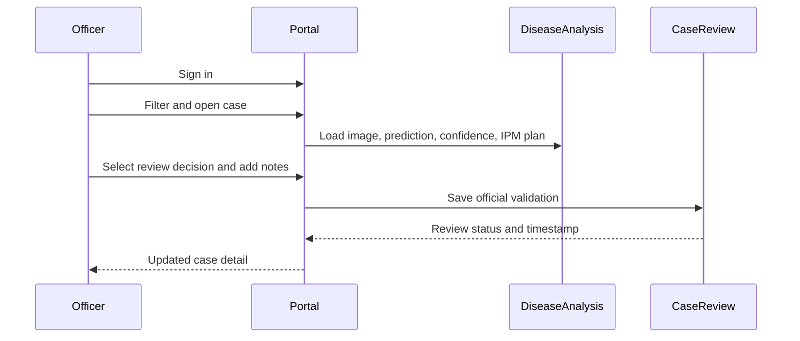
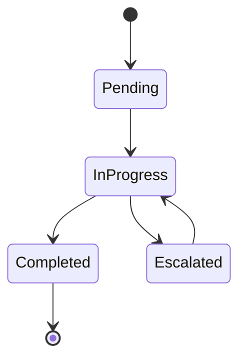
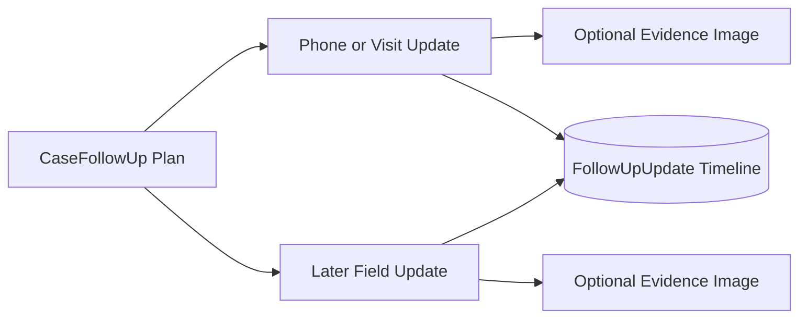
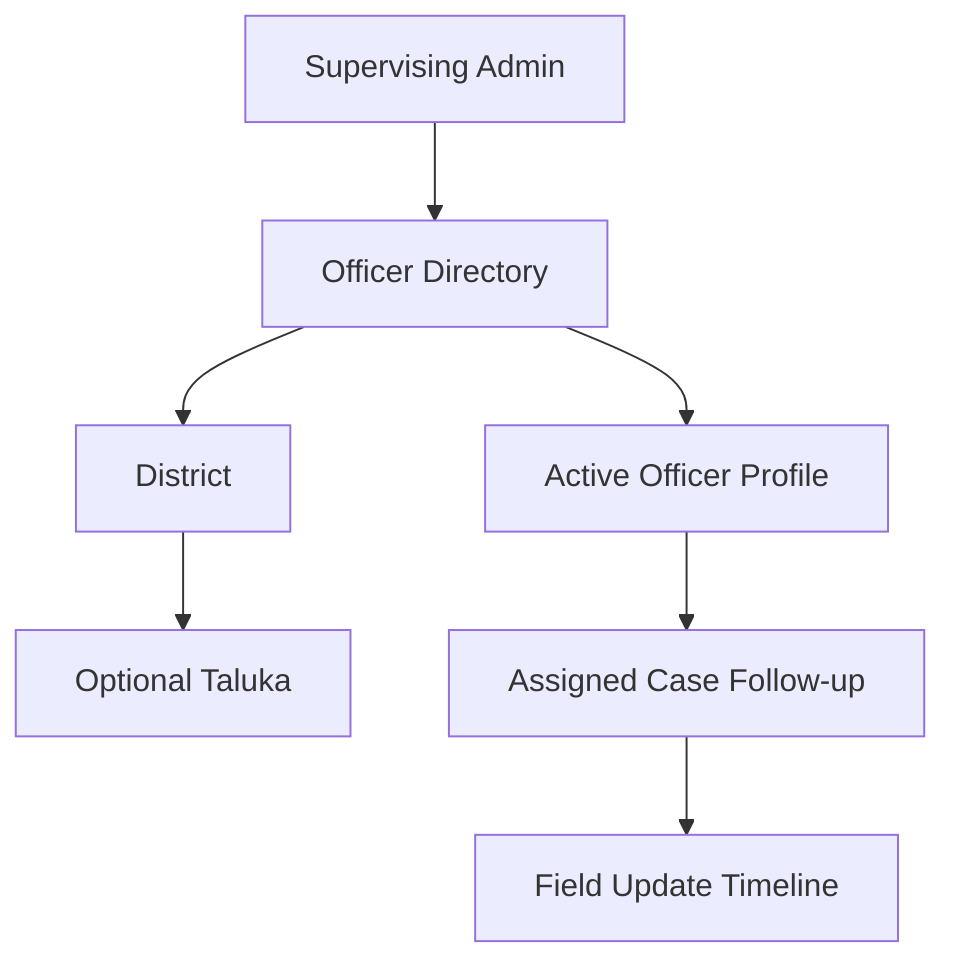

# PikDrishti AI - Technical Documentation

## Overview
PikDrishti AI is an end-to-end web application designed to assist farmers in detecting crop diseases and predicting yields. The system combines a modern web frontend with a deep learning backend powered by a Convolutional Neural Network (CNN) and leverages Large Language Models (LLMs) for generating localized, actionable advice.

## 1. Supported Crops and Diseases
The system is trained on 15 distinct classes covering **3 main crops**:
- **Pepper (Bell)**: Bacterial spot, Healthy
- **Potato**: Early blight, Late blight, Healthy
- **Tomato**: Bacterial spot, Early blight, Late blight, Leaf Mold, Septoria leaf spot, Spider mites (Two-spotted spider mite), Target Spot, Tomato Yellow Leaf Curl Virus, Tomato mosaic virus, Healthy

In total, the model detects **12 specific diseases** across these 3 crops, plus 3 healthy states.

## 2. Dataset: PlantVillage
The model is trained using the **PlantVillage dataset**, a standardized open-access dataset widely used for agricultural AI research. 
- **Quality**: Contains high-resolution images of healthy and diseased leaves under controlled conditions.
- **Coverage**: Ensures robust feature extraction for the 15 classes supported by the application.
- **Preprocessing**: Images are scaled to $224 \times 224$ pixels, normalized, and balanced using class weights during training to prevent bias toward majority classes.

## 3. Machine Learning Model (CNN)
The computer vision component utilizes **EfficientNet-B0**, a highly optimized Convolutional Neural Network (CNN).

### Architecture Diagram

### Why EfficientNet-B0?
- **Compound Scaling**: EfficientNet uniformly scales network width, depth, and resolution for better accuracy with fewer parameters.
- **Efficiency**: Small footprint (~20-30MB) makes it ideal for CPU-only deployments (like Back4Apps) while maintaining high accuracy.

## 4. Training Workflow
The training pipeline (`ml/disease/train.py`) follows standard deep learning practices:
1. **Data Loading**: PlantVillage images are split into Training, Validation, and Test sets.
2. **Data Augmentation**: Techniques like random rotation, flipping, and zoom are applied to improve model generalization.
3. **Transfer Learning**: The EfficientNet-B0 base model is loaded with ImageNet weights. The top classification layer is removed and replaced with a custom Dense layer (15 units).
4. **Fine-tuning**: 
   - Initial phase: Train only the top layers with a higher learning rate.
   - Second phase: Unfreeze top blocks of EfficientNet-B0 and fine-tune with a very low learning rate to adapt features specifically to crop leaves.
5. **Evaluation**: The model is evaluated on the test set. Best weights are saved as `disease_model.keras`.

## 5. Purpose of Google Gemini (Generative AI)
While the CNN identifies *what* the disease is, Gemini explains *how to fix it*.
- **Contextualization**: The CNN outputs a raw label (e.g., `Tomato___Early_blight`). Gemini takes this label, plus the user's manual observations, to generate plain-text advice.
- **Localization**: Gemini translates agricultural terms into local languages (e.g., Hindi) to make the app accessible to regional farmers.
- **Structured Output**: Gemini is prompted to return a strict JSON format containing:
  - `symptoms`: How to verify the disease.
  - `recommendations`: Immediate curative actions (chemical and organic).
  - `prevention`: Long-term farming practices to stop recurrence.
  - `explanation`: Simple summary of the issue.

## 6. Farmer Workflow (User Journey)
The application is designed for ease of use by farmers in the field.

### Workflow Diagram

### Steps:
1. **Capture**: Farmer opens the web app on their phone, navigates to the Scanner page, and takes a photo of the affected crop leaf.
2. **Observation**: Farmer uses the built-in Speech-to-Text feature (configured for Hindi) to dictate what they observe (e.g., "yellow spots on leaves").
3. **Analyze**: The app sends the data to the backend. The CNN classifies the disease, and Gemini generates a custom treatment plan.
4. **Action**: The farmer is redirected to a results page showing the diagnosis and actionable steps in their native language.

## 7. Integrated Pest and Disease Management

The disease-result pipeline now adds a deterministic IPM plan through `app/services/ipm_service.py`. The plan is generated from the detected crop, disease, confidence, and severity, then stored inside the existing `DiseaseAnalysis.gemini_data` JSON record under the `ipm_plan` key.

The IPM plan separates actions into:

- cultural controls
- mechanical controls
- biological controls
- chemical controls
- monitoring and repeat-scan actions
- safe input guidance
- extension or laboratory referral conditions

Gemini recommendations remain available as supplemental advice, while the structured IPM baseline provides predictable categories and conservative safety behavior. Low-confidence, unknown, or healthy results can trigger confirmation guidance rather than encouraging an immediate pesticide application.

## 8. Agriculture Officer Case Review

Protected officer routes provide a first operational review workflow:

- `/admin/login` authenticates the officer session.
- `/admin/cases` lists live `DiseaseAnalysis` records with crop, disease, farmer, confidence, severity, and search filters.
- `/admin/cases/<id>` presents the submitted evidence and IPM action plan.
- `/admin/cases/<id>/review` persists an official decision in `CaseReview`.

Review decisions currently include `under_review`, `confirmed`, `uncertain`, `lab_referral`, and `rejected`. Each review can store the confirmed disease and officer notes. This creates a durable validation point that can later support follow-up assignments, laboratory results, and model-feedback datasets.

## 9. Follow-up Management

Each disease case can now have one current `CaseFollowUp` record. Officers can save:

- priority: critical, high, moderate, or low
- progress: pending, in progress, completed, or escalated
- due date
- next action
- field or farmer-contact notes

The follow-up state is visible in the case list and case detail view. This creates the operational bridge between diagnosis review and field response. A later iteration can extend the record into a full visit history with officer assignment, contact method, treatment confirmation, and follow-up image uploads.

Each follow-up can also contain multiple `FollowUpUpdate` timeline entries. An update records the contact method, current status, officer notes, timestamp, and an optional field-evidence image. The current follow-up status is advanced whenever an update is recorded, while the historical entries remain available for review.

## 10. Officer Assignment and Jurisdiction

The officer directory uses `OfficerProfile` records with an officer ID, display name, role, district, optional taluka, and active flag. The protected `/admin/officers` page allows the supervising admin to create and review active jurisdiction profiles. Follow-up plans validate assignments against this active directory rather than accepting arbitrary officer text.

This establishes the first jurisdiction boundary for later district and taluka filtering. The current dashboard still uses a supervising `admin` session; officer-specific authentication and permissions can be layered onto these profiles in a later phase.

